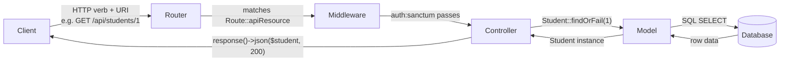

## HTTP verb → controller method mapping

| HTTP verb | URI | Controller method | Typical response code |
|-----------|-----|-------------------|-----------------------|
| GET | /api/students | `index()` | 200 |
| GET | /api/students/{id} | `show()` | 200 / 404 |
| POST | /api/students | `store()` | 201 |
| PUT | /api/students/{id} | `update()` | 200 / 404 |
| DELETE | /api/students/{id} | `destroy()` | 200 / 404 |

Register all five routes:

```php
Route::resource('students', StudentsController::class);
```

Create the controller:

```bash
php artisan make:controller api/StudentsController --api --model=Student
```

`--api` omits `create()` and `edit()` (HTML form methods). `--model=Student` wires route-model binding.



---

## Full store() / show() / destroy() implementations

> **Example**
> The three methods below come directly from the improved controller in `laravel_with_sqlite_API_SCRIPT.docx`. Read them together — they each demonstrate a different response-code pattern.

```php
// store() — POST /api/students → 201 Created
public function store(Request $request)
{
    $request->validate([
        'FirstName' => 'required',
        'LastName'  => 'required',
        'School'    => 'required',
    ]);

    $student = Student::create([
        'FirstName' => request('FirstName'),
        'LastName'  => request('LastName'),
        'School'    => request('School'),
    ]);

    return response()->json($student, 201);
}

// show() — GET /api/students/{id} → 200 or 404
public function show($id)
{
    $student = Student::find($id);
    if (!$student) {
        return response()->json(['message' => 'Student not found'], 404);
    }
    return response()->json($student);
}

// destroy() — DELETE /api/students/{id} → 200 or 404
public function destroy($id)
{
    $student = Student::find($id);
    if (!$student) {
        return response()->json(['message' => 'Student not found'], 404);
    }
    $isSuccess = $student->delete();
    return response()->json(['success' => $isSuccess]);
}
```

Key observations:
- `store()` always returns 201 as the second argument to `response()->json()`.
- `show()` and `destroy()` both check for a missing record and return a structured JSON error with 404.
- `$student->delete()` returns a boolean; wrapping it in `['success' => $isSuccess]` gives the client a parseable response.

---

## $fillable — required for mass assignment

```php
// app/Models/Student.php
protected $fillable = [
    'FirstName',
    'LastName',
    'School',
];
```

`Student::create([...])` sets multiple attributes at once. Laravel blocks this unless each attribute is listed in `$fillable`. Missing this array causes a `MassAssignmentException` at runtime.

> **Pitfall**
> The error message for a missing `$fillable` says `Add [FieldName] to fillable property to allow mass assignment`. It names the first blocked field, not all of them. After adding one field you may hit the error again for the next. Add all fields you intend to mass-assign to `$fillable` at once.

---

## Validation rules reference

```php
$request->validate([
    'field' => 'required',             // must be present and non-empty
    'field' => 'required|string',      // present, non-empty, string type
    'field' => 'required|max:255',     // present, max 255 characters
    'field' => 'nullable|string',      // optional, but if present must be string
]);
```

On failure, Laravel returns HTTP 422 with a JSON body listing each field's errors. No additional code is needed.

---

## CORS configuration

Laravel enables CORS by default (wildcard `"*"` on all methods). Configuration: `config/cors.php`.

```php
// config/cors.php — key values
'allowed_origins' => ['*'],
'supports_credentials' => false,
```

Change `allowed_origins` to a specific domain list when deploying to production. Set `supports_credentials` to `true` only if the client sends cookies or an `Authorization` header with credentials.

After any change to `config/cors.php`:

```bash
php artisan config:clear
php artisan route:clear
```

> **Pitfall**
> Changing `config/cors.php` while the config cache is active has no effect. Always run `php artisan config:clear` after modifying any file in `config/`. The same applies to route changes — `php artisan route:clear` forces a fresh route registration.

---

## Checklist: what must be true for a resource controller to work

- [ ] `routes/api.php` has `Route::resource('students', StudentsController::class)`
- [ ] Controller exists at `app/Http/Controllers/api/StudentsController.php`
- [ ] `Student` model has `protected $fillable = [...]` with all mass-assigned fields
- [ ] `store()` calls `$request->validate()` before `Student::create()`
- [ ] `store()` returns `response()->json($data, 201)`
- [ ] `show()`, `update()`, `destroy()` return 404 JSON when the record is not found
- [ ] `config/cors.php` matches the deployment environment

> **Takeaway**
> Every REST endpoint in Laravel is the intersection of a route declaration, a controller method, an Eloquent model, and a JSON response wrapper. The route maps the verb and URI. The controller validates input and calls Eloquent. The model enforces `$fillable`. `response()->json()` wraps the result with the correct status code. When an endpoint misbehaves, check each layer in that order.
