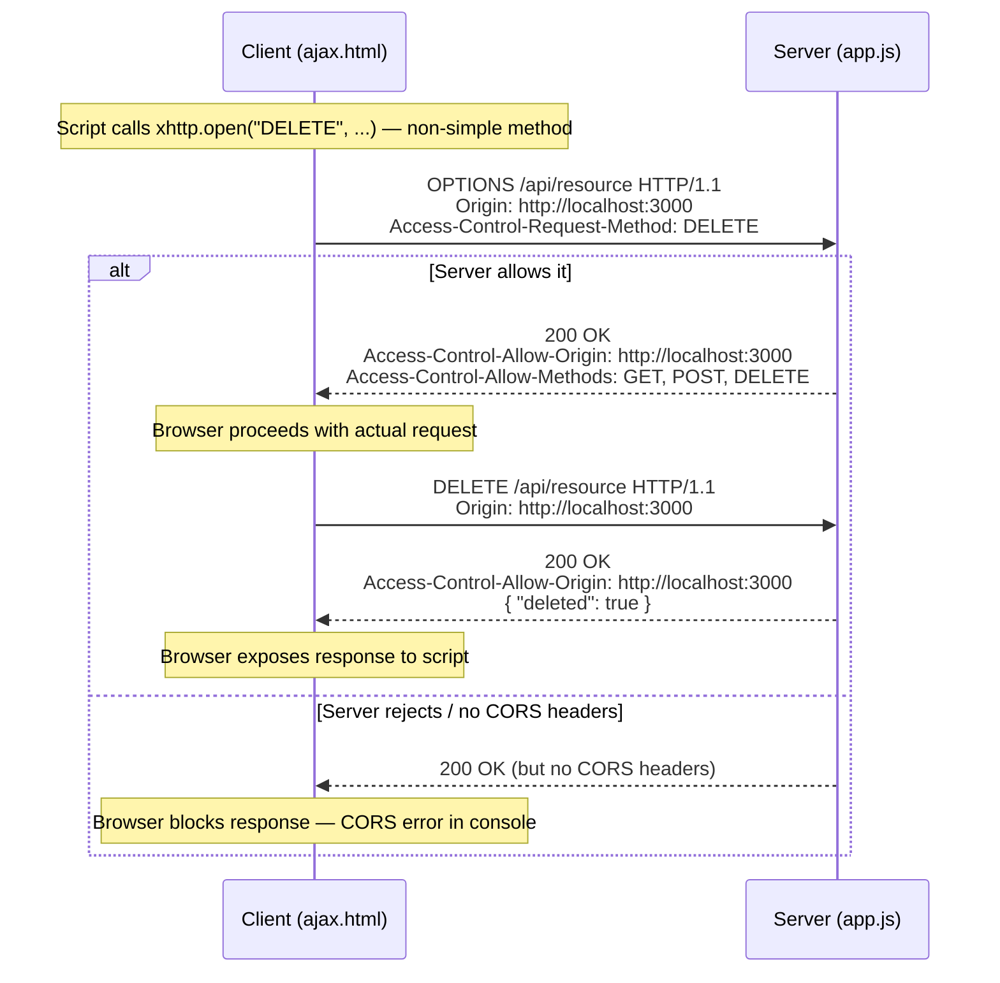

# AJAX, CORS, and Same-Origin Policy — deep dive

## The situation

You build a frontend at `http://localhost:3000` and a Node.js API at `http://localhost:8000`. You write:

```js
fetch("http://localhost:8000/api/users")
  .then(res => res.json())
  .then(data => console.log(data));
```

The browser blocks the request and logs:

```
Access to fetch at 'http://localhost:8000/api/users' from origin
'http://localhost:3000' has been blocked by CORS policy:
No 'Access-Control-Allow-Origin' header is present on the requested resource.
```

The **Same-Origin Policy (SOP)** caused this. SOP is a browser rule, not a server rule. The browser enforces it by comparing the **origin** of the document (protocol + domain + port) against the origin of the target URL. `http://localhost:3000` and `http://localhost:8000` differ on port — they are different origins.

The server received the request. The browser received the response. Then the browser *withheld* the response from the JavaScript because the response lacked CORS headers.

## XMLHttpRequest lifecycle with readyState transitions

> **Example**
>
> Full AJAX request with readyState tracking:
>
> ```js
> // Step 1 — create
> let xhttp = new XMLHttpRequest();
> // readyState is now 0 (UNSENT)
>
> // Step 2 — attach handler
> xhttp.onreadystatechange = function () {
>   // fires for every state change
>   switch (this.readyState) {
>     case 0: console.log("UNSENT — open() not called"); break;
>     case 1: console.log("OPENED — open() called"); break;
>     case 2: console.log("HEADERS_RECEIVED — headers available"); break;
>     case 3: console.log("LOADING — partial data"); break;
>     case 4:
>       if (this.status === 200) {
>         document.getElementById("demo").innerHTML = this.responseText;
>       }
>       break;
>   }
> };
>
> // Step 3 — open: method, URL, async flag
> xhttp.open("GET", "http://localhost:8000/api/users", true);
> // readyState transitions to 1 (OPENED)
>
> // Step 4 — send
> xhttp.send();
> // readyState will transition: 2 → 3 → 4 as response arrives
> ```
>
> The handler fires four times (once per non-zero transition). The check `readyState == 4 && status == 200` is the canonical guard for a successful response.

> **Pitfall**
> `readyState` spans **0 through 4**. DONE is **4**, not 5. Checking `this.readyState == 5` never fires. (Source: Slide 5, Quiz 6.)
>
> A preflight fires on *non-simple* cross-origin requests — any method besides GET or POST, or any custom request header (like `Authorization` or `Content-Type: application/json`). A plain `GET` or form-encoded `POST` to a cross-origin server does *not* trigger preflight. Students commonly assume all cross-origin requests are preflighted — they are not. (Source: Slide 5.)

## CORS preflight flow



## Enabling CORS in a Node.js http server

```js
const http = require("http");

const server = http.createServer((req, res) => {
  // Handle preflight
  if (req.method === "OPTIONS") {
    res.writeHead(204, {
      "Access-Control-Allow-Origin": "*",
      "Access-Control-Allow-Methods": "GET, POST, OPTIONS",
      "Access-Control-Allow-Headers": "Content-Type",
    });
    res.end();
    return;
  }

  res.writeHead(200, {
    "Content-Type": "application/json",
    "Access-Control-Allow-Origin": "*",
  });
  res.write(JSON.stringify({ message: "Hello" }));
  res.end();
});

server.listen(8000);
```

Key detail: the response methods are `res.writeHead()`, `res.write()`, and `res.end()` — called on the **response** object (`res`), not the request object (`req`). Using `req.write()` is a common exam trap; `req` is the incoming stream, it has no `writeHead`. (Source: ISAQuiz7 Q4.)

## withCredentials and the wildcard restriction

Setting `xhttp.withCredentials = true` tells the browser to include cookies and `Authorization` headers in the cross-origin request. The server must then respond with:

```
Access-Control-Allow-Origin: http://localhost:3000   (specific origin, not *)
Access-Control-Allow-Credentials: true
```

If the server returns `Access-Control-Allow-Origin: *` with credentials, the browser rejects the response. The wildcard and credentials are mutually exclusive.

> **Takeaway**
> SOP is a browser rule enforced by comparing origin triples (protocol + domain + port). CORS is the server's permission grant via response headers. XMLHttpRequest progresses through readyState 0 → 4; DONE is 4. Preflight (OPTIONS) fires only for non-simple requests. `res` writes the response — never `req`.
