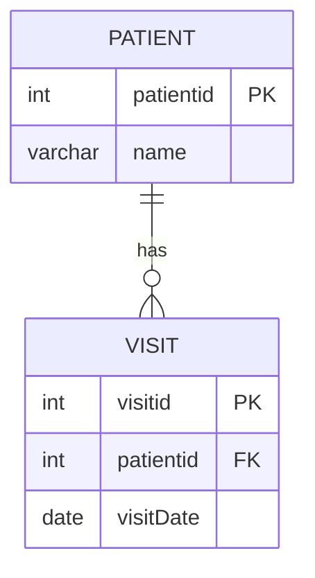
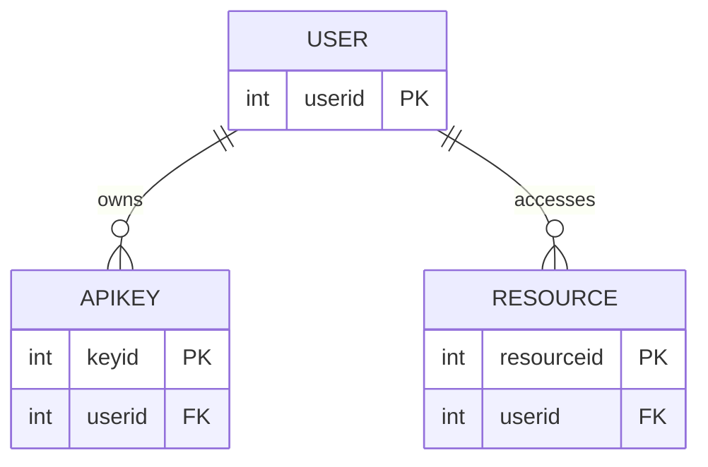

## From concrete schema to general rules

Start with the `Patient`/`Visit` schema from Slide 7. Two tables share a column (`patientid`). One table owns it as a primary key; the other borrows it as a foreign key. That pairing encodes a 1:M relationship at the database level — one patient row, many visit rows.

Generalize: any 1:M relationship follows this exact structure. The "one" side holds the primary key. The "many" side holds the foreign key referencing it.

## Identifying relationship types from a schema

**Example — ISAQuiz10 Q4:**

Given two tables:

| person | birthCertificate |
|---|---|
| personID (PK) | certID (PK) |
| name | personID (FK) |
| dob | issueDate |

Each person has exactly one birth certificate; each certificate belongs to exactly one person. The foreign key `personID` in `birthCertificate` is unique per row — no person appears twice. That constraint makes it a 1:1 relationship, not 1:M.

**Rule:** To identify the relationship type, check cardinality. If the foreign key column in the child table can repeat, the relationship is 1:M. If it is constrained to be unique, it is 1:1.

## Referential integrity in depth

Referential integrity requires that every value stored in a foreign key column exists as a primary key value in the referenced table. Violations occur in two common ways:

1. **Inserting a child row first** — creating a `visit` row whose `patientid` does not yet exist in `patient` fails immediately at the constraint check.
2. **Deleting a parent row** — removing a `patient` row that has matching `visit` rows leaves orphan records. MySQL prevents this deletion by default when a foreign key constraint is active.

The parent table (`patient`) must be created before the child table (`visit`). The child table references a table that must already exist.

## Normalization decisions: 1NF and 2NF

### 1NF

A table satisfies first normal form (1NF) when:
- Every column holds one atomic value per row.
- No repeating groups exist (no `visitDate1`, `visitDate2`, `visitDate3` columns).
- Each row is unique.

Storing `"2002-01-01, 2019-09-09"` in a single `visitDates` column violates 1NF. Splitting into separate visit rows with one date each satisfies it.

### 2NF

A table satisfies second normal form (2NF) when:
- It satisfies 1NF.
- Every non-key column depends on the **whole** primary key, not a subset.

> **Pitfall:** A table can satisfy 1NF and still violate 2NF. Consider a table with `PersonID (PK)`, `Name`, `City`, `Country`. Each cell is atomic — 1NF passes. But `Country` is determined by `City`, not by `PersonID`. That partial dependency violates 2NF. The professor's answer for ISAQuiz10 Q5: "violates 2NF, but complies with 1NF."

## When combining entities violates 2NF

Slide 10 states: "Do not use the same table to represent two different entities." Combining a `user` entity and an `APIkey` entity into one table may speed a query — but it stores two distinct concepts in one structure. Non-key columns from the `APIkey` entity depend on `APIkey`, not on `userID`. That partial dependency violates 2NF. Split them.

## API stats ERD: 1:M chains

The API stats database from Slide 10 extends the same 1:M pattern across three entities:

One user owns many API keys. One user accesses many resources. Each 1:M link uses the same primary key / foreign key mechanism shown in the Patient/Visit schema — just applied twice.

> **Pitfall:** `SELECT * FROM Tabel1, Tabel2` — a Cartesian join with no WHERE clause — always returns exactly n×m rows. Identical column names in both tables do **not** reduce the row count. Column name collisions affect which column values appear in the result set, not how many rows are returned. (ISAQuiz10 Q6)

## M:M decomposition

No direct foreign key can represent M:M. The junction table pattern decomposes M:M into two 1:M relationships:

- `Author (1) → AuthorBook (M)` via `authorid` FK
- `Book (1) → AuthorBook (M)` via `bookid` FK

The junction table's primary key is the composite of both foreign keys: `(authorid, bookid)`. Neither column alone uniquely identifies a row; together they do.
