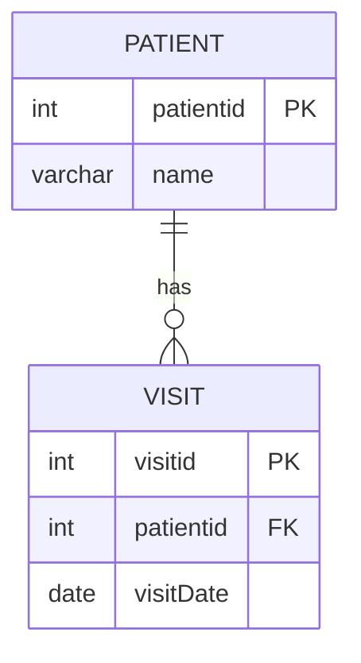

## The problem with one table

Imagine a clinic tracking patient visits in a single spreadsheet: `patientid | name | visitDate1 | visitDate2 | visitDate3`. Each new visit forces a new column — or worse, comma-separated dates stuffed into one cell. That cell holds multiple values, which breaks first normal form (1NF): every column must hold one atomic value per row. The fix is to split the data across two tables.

## Primary key and foreign key

The `Patient` table gets a `patientid` column declared as a **primary key** — a column that uniquely identifies each row and cannot be NULL. The `Visit` table gets its own `visitid` primary key, plus a `patientid` column declared as a **foreign key** — a column that references `Patient.patientid`. The foreign key is the mechanical link between the two tables.

```sql
CREATE TABLE `patient` (
  `patientid` int(11) NOT NULL,
  `name` varchar(100) DEFAULT NULL,
  PRIMARY KEY(patientid)
);

CREATE TABLE `visit` (
  `visitid` int(11) NOT NULL,
  `patientid` int(11) NOT NULL,
  `visitDate` date NOT NULL,
  PRIMARY KEY(visitid),
  CONSTRAINT fk_has_patient FOREIGN KEY(patientid)
    REFERENCES patient(patientid)
);
```

## The 1:M relationship

One patient can have many visit rows. That structure is a 1:M (one-to-many) relationship. The "one" side holds the primary key (`Patient.patientid`). The "many" side holds the matching foreign key (`Visit.patientid`).



> **Q:** Jack Ma exists in the `patient` table but has no rows in `visit`. What does `SELECT * FROM patient, visit WHERE patient.patientid = visit.patientid` return for Jack Ma?
>
> **A:** Nothing. The WHERE clause requires a matching `patientid` in `visit`. Jack Ma has no visit rows, so he is excluded.

## Referential integrity

Referential integrity means every foreign key value points to an existing primary key value. Two consequences follow directly. First, the parent table (`patient`) must be created before the child table (`visit`) — the foreign key constraint cannot reference a table that does not yet exist. Second, deleting a patient row leaves any matching visit rows without a valid parent, producing orphan rows that violate integrity.

> **Pitfall:** A Cartesian join (`SELECT * FROM patient, visit`) returns n×m rows — the product of both row counts. It does not filter by matching columns. Even if both tables share a column name, the row count stays n×m. Add a WHERE clause to get only matched pairs.

## M:M relationships and junction tables

Books and authors illustrate M:M (many-to-many): one author can write many books; one book can have many authors. A foreign key alone cannot represent both directions. The solution is a junction table (`AuthorBook`) with two foreign key columns — `authorid` and `bookid` — forming a composite primary key. This decomposes M:M into two 1:M relationships: `Author` → `AuthorBook` and `Book` → `AuthorBook`.

## First normal form (1NF) and second normal form (2NF)

**First normal form (1NF):** every column holds a single atomic value; no repeating groups; each row is unique. A column storing `"Paris, France"` as one value violates 1NF.

**Second normal form (2NF):** satisfies 1NF, and every non-key column depends on the entire primary key — not a partial subset of it. A table with `PersonID` as the primary key and columns `City` and `Country` can satisfy 1NF (each cell holds one value) yet still violate 2NF if `City` and `Country` depend on each other rather than on `PersonID` alone.

> **Q:** A table has columns `PersonID (PK)`, `Name`, `City`, `Country`. Each cell holds exactly one value. Does it satisfy 1NF? Does it satisfy 2NF?
>
> **A:** It satisfies 1NF — all values are atomic. It violates 2NF — `Country` depends on `City`, not on `PersonID`.

> **Takeaway:** Split entities into separate tables. Assign a primary key to each. Link tables with foreign keys. Verify every non-key column depends on the whole primary key, not on another non-key column.
