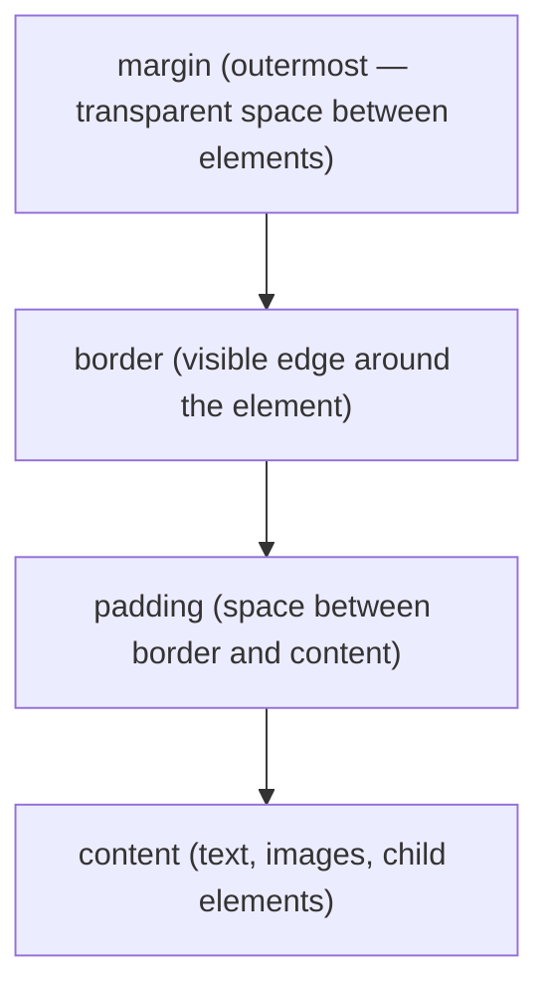

## The CSS Box Model

Every HTML element is a rectangle made of four concentric layers. The browser sizes and spaces elements using this model.



The `width` and `height` properties (by default) size only the **content** layer. Padding and border add to the total rendered size unless you set `box-sizing: border-box`.

> **Q:** List the CSS box model layers from inside to outside.
>
> <details>
> <summary>Show answer</summary>
>
> **A:** content → padding → border → margin
> </details>

---

## HTML Document Structure

A valid HTML document has a strict skeleton. The browser builds the DOM from this skeleton.

```html
<!DOCTYPE html>
<html>
  <head>
    <title>Page Title</title>
    <link rel="stylesheet" href="styles.css">
  </head>
  <body>
    <p>Visible content goes here.</p>
  </body>
</html>
```

Key rules:
- `<!DOCTYPE html>` must appear **before** `<html>` — it is not an element, it is a declaration.
- `<head>` and `<body>` are direct children of `<html>`. Neither is a child of the other.
- Loose text placed directly inside `<body>` renders normally.
- Every container element that has an opening tag requires a matching closing tag (e.g., `</table>`).

> **Q:** Where do `<head>` and `<body>` sit in the HTML document tree?
>
> <details>
> <summary>Show answer</summary>
>
> **A:** Both are direct children of `<html>`. `<head>` comes first; `<body>` follows.
> </details>

---

## CSS Selectors

| Selector form | Example | What it matches |
|---|---|---|
| Element | `p { }` | All `<p>` elements |
| Class | `.container { }` | All elements with `class="container"` |
| Element + class | `div.container { }` | `<div>` elements that also have class `container` |
| Grouping | `h1, h2, p { }` | All `<h1>`, `<h2>`, and `<p>` elements |
| Descendant | `h1 h2 p { }` | `<p>` nested inside `<h2>` nested inside `<h1>` |

Multiple classes on a single element use **space separation** in the HTML attribute: `class="one two"`.

> **Q:** Write a single CSS rule that sets the color of `<h1>`, `<h2>`, and `<p>` to red.
>
> <details>
> <summary>Show answer</summary>
>
> **A:** `h1, h2, p { color: red; }` — commas group selectors. Without the comma, `h1 h2 p` selects a `<p>` inside an `<h2>` inside an `<h1>`.
> </details>

---

## Stylesheet Delivery Methods

| Type | Syntax | Location |
|---|---|---|
| External | `<link rel="stylesheet" href="style.css">` | Inside `<head>` |
| Internal | `<style> p { color: red; } </style>` | Inside `<head>` |
| Inline | `<p style="color: red;">` | On the element itself |

---

## HTML Attributes

- `` — `src` points to the image file; `alt` provides fallback text.
- Both single quotes and double quotes are valid: `src="image.jpg"` and `src='image.jpg'` both work.

---

## Common CSS Properties

| Property | Effect |
|---|---|
| `color` | Changes **text** color |
| `background-color` | Changes the element's **background** color |
| `font-size` | Sets text size (accepts `px`, `em`, `%`) |

> **Pitfall:** `color` and `background-color` are different properties. Writing `color: blue` on a `<div>` turns the **text** blue, not the background. To set the background, use `background-color: blue`. ISAQuiz1 tests this distinction directly.

> **Pitfall:** A comma in a selector groups elements: `h1, p { }` targets both `<h1>` and `<p>`. Without the comma, `h1 p { }` selects a `<p>` descendant of `<h1>` — a completely different rule.

---

> **Takeaway:** The box model (content → padding → border → margin) governs every element's size and spacing. Selector commas group targets; spaces express ancestry. `color` sets text; `background-color` sets background.
