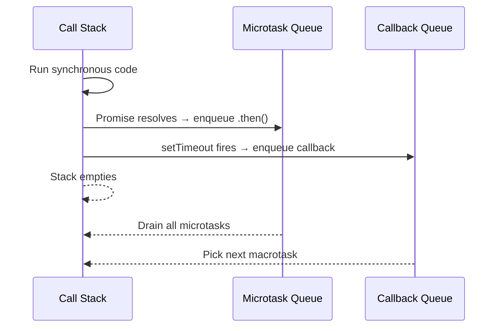

Run this in your browser console:

```js
console.log(x); // undefined — not ReferenceError
var x = 5;
console.log(x); // 5
```

The engine moves the `var x` declaration to the top of the enclosing function before execution starts. That move is hoisting. The initialization (`= 5`) stays where you wrote it. So `x` exists but holds `undefined` when the first `console.log` runs.

## How hoisting works

JavaScript's compiler pass scans for all `var` declarations in a function and registers them in the function scope before any line executes. Only the declaration moves — the assignment does not.

```js
// What you write:
function greet() {
  console.log(msg); // undefined
  var msg = "hello";
  console.log(msg); // "hello"
}

// What the engine sees:
function greet() {
  var msg;           // hoisted declaration
  console.log(msg); // undefined
  msg = "hello";
  console.log(msg); // "hello"
}
```

`let` and `const` do **not** hoist to initialization. Accessing them before their declaration throws a `ReferenceError`, not `undefined`. This zone between the block opening and the declaration is called the Temporal Dead Zone (TDZ).

```js
console.log(y); // ReferenceError: Cannot access 'y' before initialization
let y = 10;
```

## Scope rules by keyword

| Keyword | Scope | Hoisted? | Re-assignable? | Re-declarable? |
|---------|-------|----------|----------------|----------------|
| `var`   | Function (or global) | Declaration only | Yes | Yes |
| `let`   | Block `{}` | No (TDZ) | Yes | No |
| `const` | Block `{}` | No (TDZ) | No | No |

**Block scope** means the variable only lives inside the nearest enclosing `{}`. Step outside that block and the variable is gone.

```js
if (true) {
  let a = 5;
  const b = 10;
}
console.log(a); // ReferenceError: a is not defined
console.log(b); // ReferenceError: b is not defined
```

## The assignment-expression trap

`var` hoisting interacts with assignment expressions in conditions:

```js
if (m = []) {
  console.log("Green"); // prints "Green"
}
var m = 10;
```

`var m` is hoisted, so `m` exists as `undefined` at the top. `m = []` is an assignment expression — it assigns `[]` to `m` and evaluates to `[]`, which is truthy. The `if` body runs. Students expect a `ReferenceError` because `var m = 10` appears after the `if`, but hoisting moves the declaration above it.

> **Pitfall** `var` hoists the **declaration** only. Reading `x` before `var x = 5` returns `undefined` — not a `ReferenceError`. Expecting an error here is the most common exam mistake. `let` and `const` are different: they throw `ReferenceError` if you access them before their line in the block.

> **Q:** What does this print?
> ```js
> console.log(test);
> var test = 'hello';
> ```
>
> <details>
> <summary>Show answer</summary>
>
> **A:** `undefined`. The declaration `var test` is hoisted; the initialization `= 'hello'` is not. At the `console.log` line, `test` exists in scope but has never been assigned, so its value is `undefined`.
> </details>

## Functions without return

A function that reaches its closing brace without hitting a `return` statement returns `undefined`.

```js
function sum(n) {
  var s = 0;
  for (let i = 0; i < n; i++) {
    s += i;
  }
  // no return
}
console.log(sum(3)); // undefined
```

`s` holds `3` inside the function, but `console.log(sum(3))` prints `undefined` because the function never returns `s`.

> **Q:** Why does `console.log(foo(3))` print `undefined` when `foo` computes a result internally?
>
> <details>
> <summary>Show answer</summary>
>
> **A:** Every function implicitly returns `undefined` unless a `return` statement with a value is reached. The computed value stays trapped inside the function's scope.
> </details>

## The event loop

JavaScript is single-threaded non-blocking. One call stack processes all code. Long I/O operations (network, file) are delegated to the OS. When they finish, their callbacks wait in a queue. The event loop dequeues a callback only when the call stack is empty.

```
Call Stack        Callback Queue       Microtask Queue
-----------       ---------------      ----------------
main()            setTimeout cb        Promise.then cb
  fetch(...)      ──(waits)──►         ──(drains first)──►
```

The microtask queue (resolved Promise callbacks) drains completely before the event loop picks the next macrotask from the callback queue.



> **Pitfall** `setTimeout(fn, 0)` does NOT run `fn` immediately after the current line. It queues `fn` as a macrotask. Any Promise `.then()` callbacks run before `fn`, even if the Promise resolved after `setTimeout` was registered.

> **Takeaway:** `var` declarations are hoisted to function scope — read them before assignment and you get `undefined`, not an error. `let`/`const` are block-scoped and throw `ReferenceError` in the TDZ. Functions return `undefined` by default. The event loop drains the microtask queue before each macrotask.
