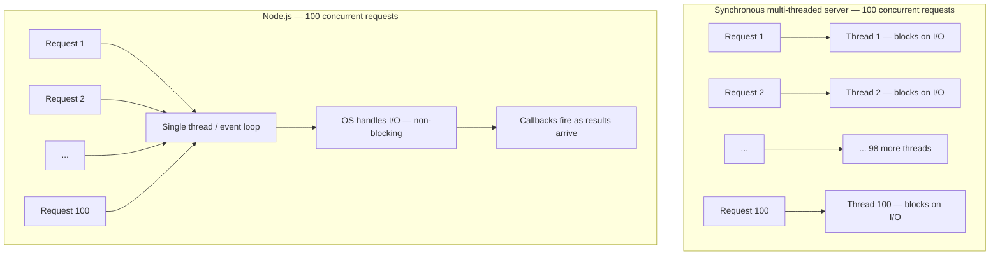

## The 100-request problem

Imagine 100 users simultaneously request a file from a web server.

A synchronous multi-threaded server (like a naive PHP/ASP.NET setup) creates one thread per request. 100 requests = 100 threads. Each thread opens the file, blocks until the OS reads it into memory, then responds. Every thread spends most of its time idle, waiting on the file system. 100 threads sit in memory, consuming resources, doing nothing.

Node.js uses one thread for all 100. It sends each file-read request to the OS, registers a callback, and immediately picks up the next request. When the OS signals that a file is ready, the callback fires and the response goes out. No thread is ever idle.

> **Example**
> Step-by-step trace of a Node.js file request:
>
> 1. Client sends HTTP GET `/data.json`.
> 2. Node.js receives the request on its single thread.
> 3. Node.js calls `fs.readFile('data.json', callback)` — this delegates to the OS, non-blocking.
> 4. Node.js returns immediately to the event loop. It is now free to handle the next incoming request.
> 5. OS finishes reading the file and signals Node.js.
> 6. The callback fires. Node.js writes the file contents to the response and calls `res.end()`.
>
> At no point did the Node.js thread sit idle waiting for the disk.

## Thread-per-request vs single-threaded non-blocking

The synchronous model scales linearly in thread count. The Node.js model does not — one thread serves all requests as long as I/O is non-blocking.

## Why single-threaded non-blocking works

The Chrome V8 engine compiles JavaScript to native machine code. Node.js wraps V8 with an I/O layer (libuv) that delegates file and network operations to the OS asynchronously. The OS is fast at I/O; the thread never needs to wait for it.

The event loop continuously checks: is any callback ready? If yes, run it. If no, wait. The thread is never parked waiting on I/O — it only runs JavaScript.

## Built-in modules (Quiz 7 reference)

Node.js ships with built-in modules. `fs` handles the file system. `http` creates web servers. `url` parses URLs. `mysql` is NOT a built-in module — it is a third-party package installed via npm.

> **Pitfall**
> Single-threaded does NOT mean slow for I/O-bound workloads. The thread never blocks on I/O — it delegates and moves on. However, CPU-bound operations (large loops, cryptography, image processing) DO block the event loop because they monopolise the thread. Keep request handlers I/O-bound or offload CPU work to worker threads.

> **Takeaway**
> Node.js achieves concurrency without threads by running single-threaded non-blocking: I/O is delegated to the OS, callbacks fire when results are ready, and the single thread is always free to handle the next request. This is memory-efficient at scale — 100 concurrent requests cost one thread, not 100.
