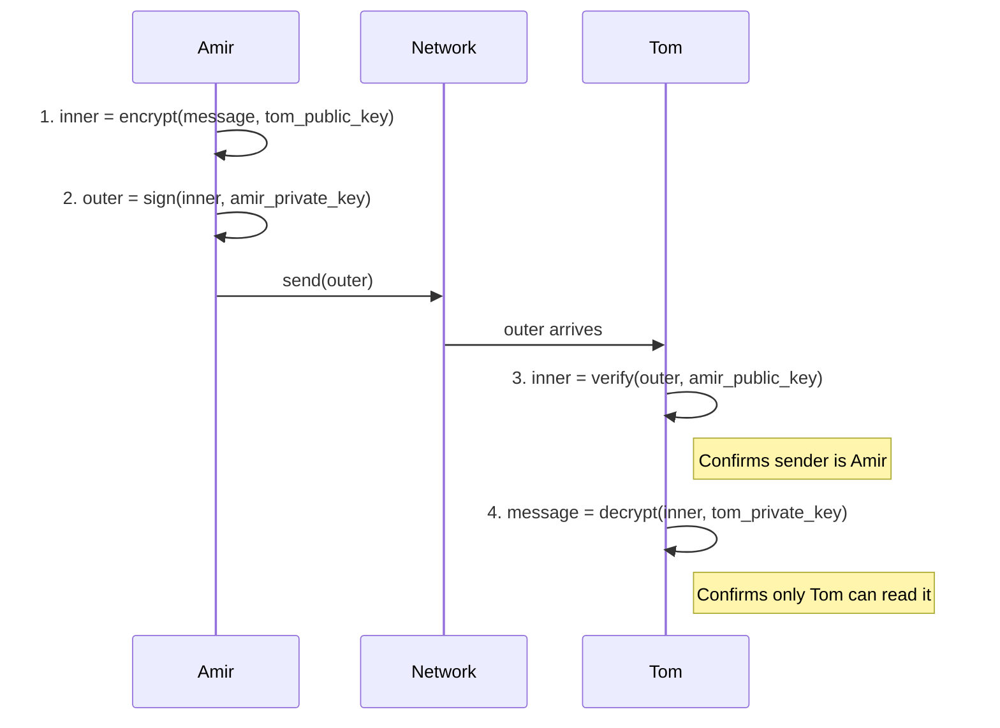

## The key exchange problem

Imagine you want to mail a locked box to a friend. You lock the box, but now you need to send her the key so she can open it. You mail the key separately — but anyone who intercepts it can make a copy. The box is useless.

This is the key exchange problem. Two parties want to communicate privately, but to encrypt and decrypt messages they first need to share a secret key. Sending that key over an unsecured network defeats the purpose. If the channel is already insecure, you cannot safely transmit the very key that would make it secure.

Symmetric encryption uses the same secret key to lock and to unlock. Both parties must have that key before any secure exchange can happen. Getting the key to the other party securely — without already having a secure channel — is a circular problem.

This is exactly the problem that motivated asymmetric encryption, RSA, and the Diffie-Hellman protocol.

---

## Symmetric vs asymmetric encryption

**Symmetric encryption** uses one secret key shared by both parties. It is fast and simple once the key is established. The hard part is establishing the key safely.

**Asymmetric encryption** uses two mathematically linked keys — a public key and a private key — that belong to one person.

- Tom generates a key pair: `tom_public_key` and `tom_private_key`.
- Tom shares his public key with everyone. He keeps his private key secret.
- What Tom locks with his private key, only Tom's public key can open.
- What others lock with Tom's public key, only Tom's private key can open.

This eliminates the key exchange problem. Anyone can encrypt a message to Tom using his public key — a key he shares openly. Only Tom can decrypt it, because only Tom holds the private key.

---

## Signing is not the same as encrypting

Signing and encrypting are different operations with opposite key directions.

| Operation | Sender uses | Receiver uses |
|---|---|---|
| Encryption (confidentiality) | Receiver's public key | Receiver's private key (to decrypt) |
| Signing (authenticity) | Sender's private key | Sender's public key (to verify) |

**Encryption** ensures only the intended receiver can read the message. You lock it with the receiver's public key. Only the receiver's private key opens it.

**Signing** proves the message came from the sender and was not tampered with. The sender locks (signs) the message with their own private key. Anyone with the sender's public key can verify the signature — but only the true sender could have produced it, because only they hold the private key.

---

## The Amir→Tom double-envelope scenario

Amir wants to send a message to Tom with two guarantees: only Tom can read it, and Tom can verify it came from Amir. Both have each other's public keys.

**Step 1 — Confidentiality (inner envelope).**
Amir encrypts the message with Tom's public key. Only Tom's private key can decrypt this inner envelope.

**Step 2 — Authenticity (outer envelope).**
Amir signs the entire inner envelope with his own private key. The result is an outer envelope that only Amir could have produced.

**Step 3 — Tom verifies the sender.**
Tom opens the outer envelope using Amir's public key. If it opens, the signature is valid — the message came from Amir and was not altered in transit. Signing ≠ encrypting: this step uses Amir's public key, not Tom's keys.

**Step 4 — Tom decrypts the content.**
Tom opens the inner envelope using his own private key. The message is readable only to Tom.

---

## Retrieval checkpoint

> **Q:** Amir signed the outer envelope with his private key. Which key does Tom use to verify that the message came from Amir?
>
> **A:** Tom uses **Amir's public key**. Signing uses the sender's private key; verification uses the sender's public key. Tom's own keys are not involved in the verification step — they are only used to decrypt the inner (confidential) envelope.

---

> **Q:** Amir encrypted the inner envelope with Tom's public key. Which key opens the inner envelope?
>
> **A:** **Tom's private key**. Encryption for confidentiality uses the receiver's public key; decryption uses the receiver's private key.

---

## Secret key vs private key

A **secret key** is the shared key used in symmetric encryption. Both parties hold the same key. Keeping it secret from outsiders is the only protection.

A **private key** is one half of an asymmetric key pair. Only its owner holds it. The paired public key is shared openly. Do not use these terms interchangeably — they describe different systems with different security models.

---

**Pitfall:** Verification uses the SENDER's public key — not the receiver's keys. ISAQuiz11 Q9 asks which key Tom uses to verify Amir's message. All four key combinations appear as answer choices. Only "Amir's public key" is correct. The trap is conflating "verify" (sender's public key) with "decrypt" (receiver's private key). Signing and encryption are separate operations. Signing: sender uses their private key → receiver verifies with sender's public key. Encryption: sender uses receiver's public key → receiver decrypts with their own private key. The directions are opposite. Getting them reversed is the single most common wrong answer on this topic.

---

**Takeaway:** Symmetric encryption is fast but requires a shared secret key — the key exchange problem makes it unsafe over an open network. Asymmetric encryption solves this by separating public and private keys: anyone can encrypt to you with your public key, but only you can decrypt. Signing proves authorship using the sender's private key; anyone with the sender's public key verifies the signature. These two operations — signing and encryption — use opposite key directions. Never confuse them.
