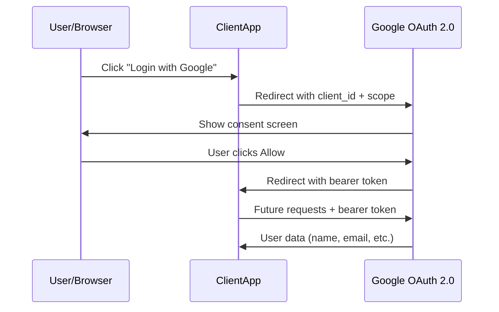

Your app needs a user's Google contacts. Asking for their Google password is a security disaster — it gives your app full account access forever. OAuth 2.0 solves this by delegating authentication to Google and issuing a scoped, time-limited bearer token instead.

## The problem OAuth 2.0 solves

Your ClientApp wants to read a user's Google profile or calendar. The user does not want to hand you their Google password. OAuth 2.0 lets Google authenticate the user and then hand your app a limited-use token — no password ever touches your server.

## SSL/TLS: the encrypted channel underneath

Before OAuth 2.0 or any sensitive data flows, the connection itself must be encrypted. SSL/TLS (Transport Layer Security — TLS is the current protocol; SSL is deprecated) provides that encryption layer. When a browser opens an `https://` URL, it performs a TLS handshake with the server.

The handshake does two things:

1. **Authentication** — the server sends its SSL/TLS certificate, which contains the server's public key. The browser verifies this certificate against a trusted Certificate Authority.
2. **Key exchange** — browser and server negotiate a shared session key using the public key. All subsequent data is encrypted and decrypted automatically.

Your application code does not implement this encryption. The TLS layer handles it transparently. HTTPS = HTTP running over TLS.

> **Q:** Why does the TLS handshake send the server's public key inside the certificate?
> **A:** The browser uses the public key to securely exchange a session key. Only the server (holding the matching private key) can decrypt it, proving the server's identity and establishing the encrypted channel.

## OAuth 2.0: the four-step flow

### Step 0 — Onboarding (one-time setup by the app owner)

Before any user can log in, the app owner registers ClientApp at the Google Developer Console. The owner fills in a form specifying which user data the app needs (profile, contacts, calendar). Google approves the registration and issues two credentials:

- **Client ID** — a public identifier for ClientApp, sent in redirect URLs.
- **Client secret** — a private credential kept server-side only; never sent to the browser.

Google also provides the code snippet to render the "Login with Google" button.

### Step 1 — User clicks "Login with Google"

The user clicks the button in ClientApp. ClientApp redirects the user's browser to the Google OAuth 2.0 endpoint, including the client ID in the URL:

```
https://accounts.google.com/o/oauth2/auth?client_id=CLIENT_ID&redirect_uri=...&scope=profile email
```

### Step 2 — Google authenticates the user and shows the consent screen

Google receives the request, looks up the client ID, and displays a consent screen listing exactly what data ClientApp has requested. The user sees: "ClientApp wants to access your name and email."

### Step 3 — User approves; Google issues a bearer token

Upon the user clicking "Allow," Google generates a bearer token for this specific user-app pair. Google redirects the browser back to ClientApp's registered redirect URI, carrying the bearer token.

### Step 4 — ClientApp uses the bearer token

ClientApp now holds the bearer token. It sends this token in the `Authorization` header with every future request to Google APIs:

```
Authorization: Bearer <token>
```

Google sees the token, identifies the user, and returns the requested data.

## Bearer tokens: possession equals authorization

Anyone who holds this token is implicitly granted authorization. The bearer token does not require the holder to prove identity beyond possession — holding it is enough. This has two consequences:

- Bearer tokens are **time-limited** (for example, 6 months). After expiry, the user must re-authorize.
- ClientApp must protect the token. Exposing it (for example, logging it or storing it in a browser-accessible location) gives any attacker the same access as the legitimate app.

ClientApp signs outgoing requests using its private key and Google's public key to prevent token interception in transit.

## OAuth 2.0 as delegation

OAuth 2.0 delegates the responsibility of authenticating users to Google. ClientApp does not store, verify, or manage Google passwords. It gains scoped access to user data (name, email, contacts — whatever the user approved) without handling credentials directly.



> **Q:** What happens if an attacker intercepts the bearer token?
> **A:** The attacker gains full authorization for the scope the token covers — anyone who holds this token is implicitly granted authorization. ClientApp must secure the token and rely on its time limit and HTTPS transport to limit exposure.

> **Pitfall**
> The client secret and bearer token are different things. The client secret identifies the app (stored server-side permanently). The bearer token authorizes one user's session (time-limited, issued each login). Exposing either to the browser — for example, storing the client secret in frontend JavaScript — breaks the security model entirely.

**Takeaway:** SSL/TLS encrypts the channel automatically so OAuth 2.0 tokens travel safely. OAuth 2.0 lets ClientApp access user data by delegating authentication to Google — the user approves a consent screen and Google issues a time-limited bearer token. The client ID is public; the client secret and bearer token must stay private.
