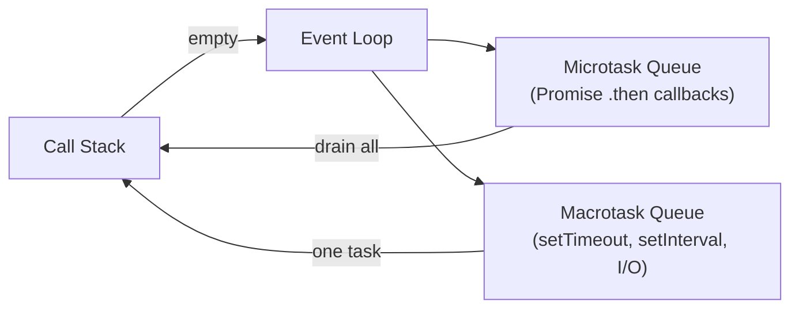

Run this code and predict the output before reading on:

```js
setTimeout(function() {
  console.log(1);
  console.log(2);
  console.log(3);
}, 500);
console.log(4);
```

Output: `4`, then `1`, `2`, `3`. The synchronous `console.log(4)` fires immediately. The `setTimeout` callback waits at least 500 ms in the macrotask queue, then runs only after the call stack is empty.

## The single-threaded non-blocking model

JavaScript runs on a single thread. One thread means one thing executes at a time — no parallel execution. "Non-blocking" means that thread never sits idle waiting for I/O.

Think of a restaurant with one waiter. That waiter takes your order, hands it to the kitchen (the OS), and immediately serves other tables. When the kitchen is done, the waiter picks up and delivers. The waiter never stands at the pass waiting.

Node.js works the same way. The V8 engine compiles your JS to native machine code and executes it on one thread. When your code hits a file read or network request, Node.js delegates that work to the operating system. The OS signals completion; Node.js resumes via a callback.

Contrast this with a thread-per-request model. One hundred simultaneous requests spawn one hundred threads. Each thread blocks waiting for its I/O. The single-thread async model handles those same one hundred requests on one thread — no blocking, no idle waste.

## The event loop mechanism

The event loop coordinates three structures: the call stack, the microtask queue, and the macrotask queue.



The event loop follows this exact cycle on every tick:

1. Run the current synchronous code to completion (the call stack drains).
2. Drain the **entire** microtask queue — every resolved-Promise `.then()` callback runs.
3. Pull **one** task from the macrotask queue and run it.
4. Repeat.

`setTimeout` and `setInterval` are Web APIs. Calling `setTimeout(fn, 500)` hands `fn` to the browser/Node.js runtime, which schedules it as a macrotask after at least 500 ms. `forEach` and `console.log` are synchronous — they run inline on the call stack with no queuing.

## Microtasks beat macrotasks

```js
setTimeout(function() {
  console.log(1);
}, 1);

new Promise(function(resolve) {
  console.log(2); // executor — runs eagerly, sync
  resolve();
}).then(function() {
  console.log(4); // microtask
});

console.log(3); // sync
```

Output: `2`, `3`, `4`, `1`.

Trace the execution:

1. `setTimeout` registers its callback as a macrotask. Control moves on.
2. `new Promise(executor)` runs the executor **immediately** — `console.log(2)` fires now.
3. `resolve()` enqueues the `.then` callback to the microtask queue.
4. `console.log(3)` runs — still sync.
5. Call stack empties. The event loop drains the microtask queue: `console.log(4)`.
6. Only now does the macrotask fire: `console.log(1)`.

> **Q:** Given this code, what is the output and why?
>
> ```js
> const fn1 = () => new Promise((resolve, reject) => {
>   console.log(1);
>   resolve('success');
> });
> fn1().then((res) => {
>   console.log(res);
> });
> console.log('start');
> ```
>
> <details>
> <summary>Show answer</summary>
>
> **A:** `1`, `start`, `success`.
>
> The Promise executor runs eagerly when `fn1()` is called — `console.log(1)` fires immediately. `resolve('success')` enqueues the `.then` callback as a microtask. `console.log('start')` runs next (still sync). When the stack empties, the microtask queue drains: the `.then` callback logs `success`.
> </details>

> **Pitfall**
> `.then()` does not run the moment `resolve()` is called. `resolve()` only *enqueues* the callback. The callback runs after every synchronous statement in the current call stack has executed. Students who assume `.then()` fires inline consistently get exam questions on Promise ordering wrong.

A second trap: if the executor never calls `resolve()` or `reject()`, the Promise stays pending forever. Every `.then()` chain attached to it is silently skipped.

```js
new Promise(function(resolve) {
  console.log(1);
  console.log(2);
  // resolve never called
}).then(() => console.log(3)).then(() => console.log(4));

console.log(5);
// Output: 1, 2, 5  — 3 and 4 never print
```

> **Takeaway:** Synchronous code always wins. Promise executors run eagerly (sync), `.then()` callbacks are microtasks (after sync), and `setTimeout` callbacks are macrotasks (after microtasks). Nail that ordering and event-loop exam questions become mechanical.
