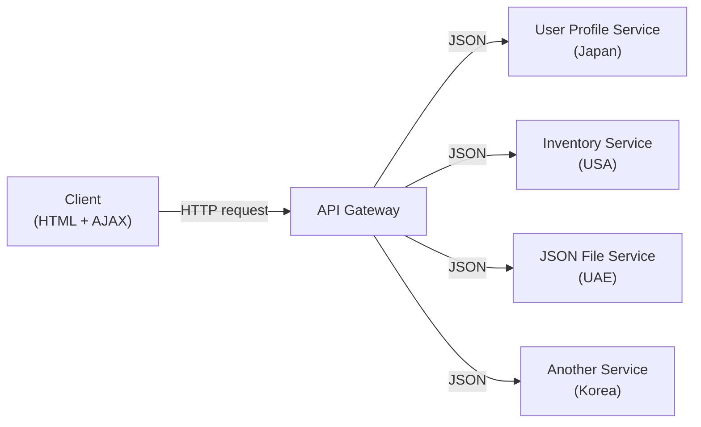

## When Facebook goes down, Messenger keeps running

Messenger is a separate service from Facebook's main app. The two can run on different machines, different technology stacks, and different deployment schedules. If Facebook's core servers crash, Messenger does not necessarily crash with them.

That independence is the defining property of MSA (Microservice Architecture, also called SOA — Service-Oriented Architecture — in this course). Before MSA became standard, most web apps were monolithic. Understanding why teams moved away from monolithic architecture requires seeing what monolithic architecture actually costs.

> **Q:** You deploy a monolithic e-commerce app. You want to add a discount-coupon feature. What must you do to the running app before you can ship the new code?
>
> **A:** You must shut down the entire application, add the feature to the unified codebase, recompile the whole thing, and then redeploy. Every user loses access during that window — even parts of the app (checkout, login, product search) that had nothing to do with the change.

---

## Monolithic architecture

All application logic — UI, business logic, data access — lives in a single deployable unit. You build it once, run it on one machine, and maintain one backend technology stack.

**Pros:**
- Simple to build and deploy for small projects
- No inter-service network calls; everything runs in the same process
- Easy to test end-to-end without mocking external services

**Cons:**
- Every deploy requires a full shutdown and recompile
- One failing component can bring down the entire application
- As the codebase grows, changes become risky and releases slow

**Best for:** prototyping, MVPs, or apps that do not expect frequent independent feature updates.

> **Pitfall**
> Adding a single feature to a monolithic app means shutting down the entire application. MSA avoids this by letting you redeploy individual services independently.

---

## Layered (n-Tier) architecture

Layered architecture divides the application into horizontal slices, each responsible for one functional concern.

```
┌────────────────────────────┐
│     Presentation Layer     │  ← User interaction (UI)
├────────────────────────────┤
│      Business Layer        │  ← Application logic, decision making, routing
├────────────────────────────┤
│     Application Layer      │  ← Core functions, shared libraries
├────────────────────────────┤
│     Data Access Layer      │  ← Database reads/writes
└────────────────────────────┘
```

Each layer talks only to the layer directly below it. The presentation layer never reaches past the business layer to touch the database directly.

This separation of concerns makes the system testable: you can swap out the data access layer (e.g., replace SQL with NoSQL) without rewriting business logic. Core banking platforms use layered design specifically for regulatory compliance — auditors can verify that no UI code directly touches financial records.

> **Q:** In a layered architecture, which layer handles "should this user be allowed to do this operation?" — and which layer executes the SQL query to retrieve their account?
>
> **A:** Authorization decisions live in the Business Layer (it controls logic and routing). The SQL query runs in the Data Access Layer. These concerns are deliberately separated so that policy changes (business layer) don't require touching database code.

---

## MSA / SOA (Microservice Architecture)

MSA breaks an application into a collection of loosely coupled services. Each service runs independently, owns a single function, and communicates with other services exclusively through API calls.

> **Pitfall**
> MSA and SOA refer to the same thing in this course. Do not contrast them or treat SOA as a separate, older alternative.

Key characteristics:
- Each service can run on a separate machine in a separate geographic region
- Services are written in different technology stacks (one in Python, another in Node.js)
- Deploying or fixing one service does not require shutting down others
- One team can own one service end-to-end

**Trade-offs:**

| Advantage | Cost |
|-----------|------|
| Independent deployment per service | More complex overall system |
| Teams can work in parallel | Services communicate only via API — many network round-trips |
| One failure doesn't cascade | Distributed debugging is harder |

**Real-world users:** Uber, Netflix, Amazon, eBay, SoundCloud, Groupon, realtor.com (Vancouver-area).

---

## API-centric MSA — the pattern you build in this course

In COMP4537 you practice a specific flavor of MSA where all communication goes through a central API gateway.



The client never calls services directly. The API gateway routes each request to the correct service. Every service returns JSON. Because client and servers are not on the same machine, all responses cross origin — meaning CORS and RESTful design apply.

---

## Serverless / Function-as-a-Service (FaaS)

Serverless lets you run small, stateless functions in the cloud without provisioning or managing servers. The server infrastructure is built and maintained by someone else; you access it through API calls.

**Best for:** apps with unpredictable or spiky traffic — you pay per invocation, not per idle server. Common uses: image processing, notification dispatch, data transformation pipelines.

> **Example**
> Your term-one apps with no server-side scripting were effectively serverless — you sent API requests to image or data servers that someone else operated, and received processed results in return.

> **Q:** What makes an architecture "serverless" — and what is the developer actually responsible for?
>
> **A:** "Serverless" means the infrastructure management (provisioning, scaling, patching) is handled by a cloud provider. The developer is responsible only for the function logic and the API contract. The hardware and runtime still exist — the developer just doesn't manage it.

---

## MVC (Model-View-Controller)

MVC organizes application code into three roles:

| Component | Responsibility |
|-----------|----------------|
| Model | Data and business rules |
| View | What the user sees (UI rendering) |
| Controller | Receives user input, coordinates Model and View |

Web frameworks built on MVC: Django (Python), Rails (Ruby), ASP.NET MVC (.NET). GitHub's original codebase was built on Ruby on Rails.

---

## MVVM (Model-View-ViewModel)

MVVM is an evolution of MVC designed for rich client-side interfaces that need two-way data binding.

| Component | Responsibility |
|-----------|----------------|
| Model | Data and domain logic |
| View | Declarative UI template |
| ViewModel | Exposes data streams; syncs View and Model automatically |

When the user edits a form field, the ViewModel updates the Model without the developer writing explicit event handlers. Frameworks: Angular, Vue, React with state management libraries.

---

## Patterns can be combined

No real-world system uses exactly one pattern. Netflix started as a monolith, restructured into a layered app, then migrated to microservices, and now layers event-driven processing and CQRS on top of its MSA core. The architectural choice depends on scale, team structure, and change velocity — not ideology.

---

**Takeaway:** Architectural patterns are mechanisms for managing change. Monolithic architecture is cheapest to start; MSA makes independent deployment possible; layered architecture enforces separation of concerns; serverless shifts infrastructure cost to a provider. Choosing a pattern means choosing which kinds of change you want to be easy and which trade-offs you accept.
