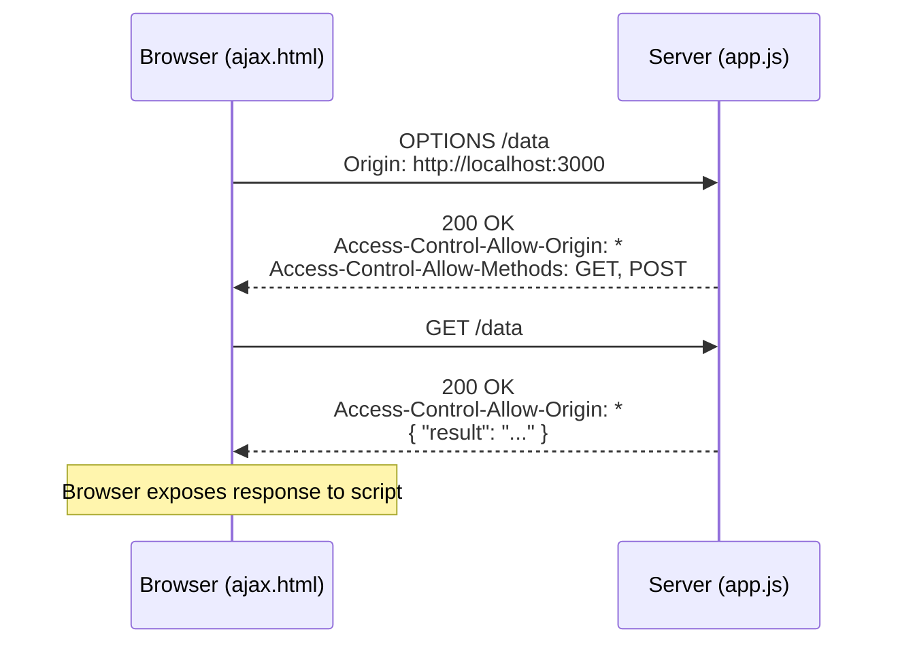

## Why the browser blocks cross-origin requests

Open your browser console and run this from `http://localhost:3000`:

```js
fetch("https://api.example.com/data");
```

The browser throws:

```
Access to fetch at 'https://api.example.com/data' from origin
'http://localhost:3000' has been blocked by CORS policy.
```

That error comes from the **Same-Origin Policy (SOP)** — a browser rule that blocks scripts from reading responses across origins. An **origin** is the exact triple of protocol + domain + port. `http://localhost:3000` and `https://localhost:3000` are *different* origins; so are `http://localhost:3000` and `http://localhost:8000`.

SOP exists to stop a malicious page from silently reading your bank's API using your session cookies.

## What CORS does

CORS (Cross-Origin Resource Sharing) is a server-configured mechanism that tells the browser: "this cross-origin request is permitted." The server adds response headers; the browser reads them and decides whether to expose the response to the script.

The key header:

```
Access-Control-Allow-Origin: *
```

`*` means any origin may read the response. A specific value like `http://localhost:3000` restricts it to that origin only.

Two additional headers control which methods and custom headers are allowed:

```
Access-Control-Allow-Methods: GET, POST
Access-Control-Allow-Headers: Content-Type
```

## AJAX: sending requests without reloading

AJAX is a technique for issuing HTTP requests from browser script without navigating the page. The core object is `XMLHttpRequest`. The four-step lifecycle:

```js
// Step 1 — create the object
let xhttp = new XMLHttpRequest();

// Step 2 — attach a handler; fires on every readyState change
xhttp.onreadystatechange = function () {
  if (this.readyState == 4 && this.status == 200) {
    document.getElementById("demo").innerHTML = this.responseText;
  }
};

// Step 3 — open: method, URL, async flag
xhttp.open("GET", "https://api.example.com/data", true);

// Step 4 — send
xhttp.send();
```

> **Pitfall**
> `readyState` runs from 0 to 4, not 1 to 5. DONE is **4**. Checking `readyState == 5` always fails silently. (Source: Slide 5, Quiz 6.)

`readyState` transitions in order:

| Value | Name | Meaning |
|---|---|---|
| 0 | UNSENT | Object created; `open()` not yet called |
| 1 | OPENED | `open()` called |
| 2 | HEADERS_RECEIVED | `send()` called; response headers available |
| 3 | LOADING | Response body arriving; `responseText` updating |
| 4 | DONE | Operation complete |

## The preflight request

For non-simple cross-origin requests — those using methods other than GET/POST or custom headers — the browser sends a **preflight** first. A preflight is an OPTIONS request to the same URL asking "are you willing to serve this kind of request?"

```
OPTIONS /data HTTP/1.1
Origin: http://localhost:3000
Access-Control-Request-Method: DELETE
```

If the server responds with the correct `Access-Control-Allow-*` headers, the browser proceeds with the actual request. If not, the browser blocks it before the real request ever leaves.



> **Q:** A browser script on `http://localhost:3000` tries to send a `DELETE` request to `https://api.example.com`. What does the browser do first?
>
> **A:** It sends an OPTIONS preflight to `https://api.example.com` to confirm the server permits DELETE from that origin. Only if the server responds with the correct CORS headers does the browser issue the actual DELETE.

## withCredentials

To include cookies and authentication headers in a cross-origin request, set the `withCredentials` flag:

```js
xhttp.withCredentials = true;
```

The server must then respond with `Access-Control-Allow-Origin` set to a *specific* origin (not `*`) and `Access-Control-Allow-Credentials: true`. Sending credentials to a wildcard origin is blocked by the browser.

## GET vs POST

GET requests can be bookmarked; query parameters sit in the URL. POST requests cannot be bookmarked; the body holds the data. For form-encoded POST bodies, the content type is `application/x-www-form-urlencoded` and the server reads data in chunks.

> **Takeaway**
> SOP blocks cross-origin reads by default. CORS lets the *server* grant exceptions via response headers. AJAX uses XMLHttpRequest in four steps: create → handler → open → send. The preflight OPTIONS request fires before any non-simple cross-origin request. readyState 4 means DONE — never 5.
