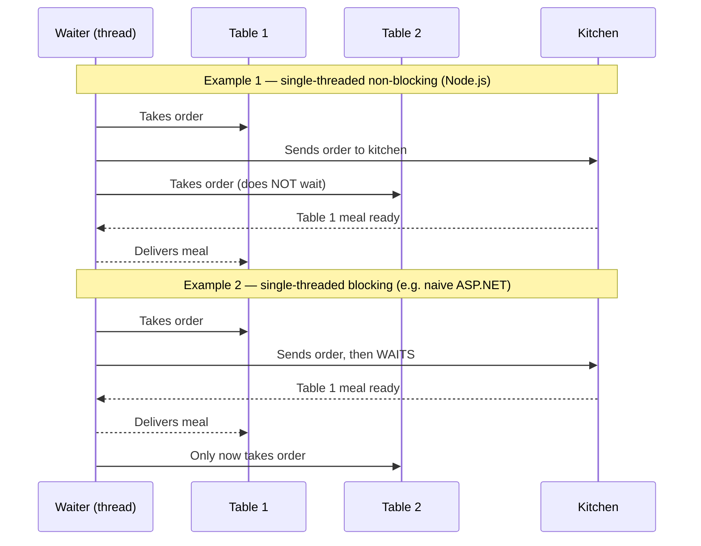

## The blocking problem

A PHP server handling 100 concurrent requests creates 100 threads. Node.js handles all 100 with one.

Each thread consumes memory. At scale, 100 threads means 100 allocations sitting idle, each waiting for a file read or database response. The thread is blocked — it cannot do anything else until the operation completes.

Node.js avoids this by never waiting. When it delegates a task to the operating system (read a file, query a database), it immediately picks up the next request. When the OS signals completion, a callback fires and the response goes out.

## The Chrome V8 engine

Node.js is an open-source, cross-platform, back-end JavaScript runtime built on the Chrome V8 engine. V8 compiles JavaScript directly to native machine code — this is why Node.js runs JavaScript outside a web browser at competitive speed.

## Single-threaded non-blocking execution

Node.js runs single-threaded non-blocking. One thread, no waiting. The event loop dispatches work to the OS and processes callbacks as results arrive.

This makes Node.js memory-efficient. Traditional thread-per-request servers dedicate one thread per concurrent user. Node.js does not — it reuses the same thread for every request.

## Restaurant analogy

Slide 4 illustrates three concurrency models with a restaurant:

**Example 1 (Node.js model):** The waiter takes an order at Table 1, hands it to the kitchen, and immediately goes to Table 2. The waiter never idles.

**Example 2 (blocking model):** The waiter takes an order at Table 1, then stands at the kitchen window doing nothing until the meal is ready. Table 2 waits the entire time.

**Example 3 (multi-threaded model):** Hire 100 waiters — one per table. Each waiter blocks, but there are enough of them for everyone. This is the traditional thread-per-request approach. For 100 concurrent requests, it requires 100 threads.

> **Q:** In the restaurant analogy, Example 1 represents which Node.js execution model?
> **A:** Single-threaded non-blocking. One waiter (thread) serves multiple tables by delegating to the kitchen (OS) and moving on, never waiting for a result before taking the next request.

> **Q:** Why is the multi-threaded model (Example 3) less memory-efficient than Node.js at scale?
> **A:** Each thread consumes memory. 100 concurrent requests require 100 threads, all sitting blocked on I/O. Node.js uses one thread for all 100 by not blocking.

## Server-side scripting capabilities

A Node.js server can:

- Generate dynamic page content
- Create, read, write, and delete files on the server
- Collect form data
- Add, delete, and modify data in a database

## Server architecture

The standard architecture runs: client (browser) sends an HTTP request to a Node.js web server, which queries a database server. All three can run on the same machine (localhost) or on separate machines.

> **Pitfall**
> "Single-threaded" does not mean slow. One thread handles many concurrent requests precisely because it never blocks on I/O. CPU-bound work (heavy computation) does block the thread — avoid it in the request handler.

> **Takeaway**
> Node.js achieves high concurrency by running single-threaded non-blocking: one thread delegates I/O to the OS and processes callbacks as they arrive. This eliminates the per-thread memory overhead of traditional servers and is why Node.js handles 100 concurrent requests with one thread instead of 100.
