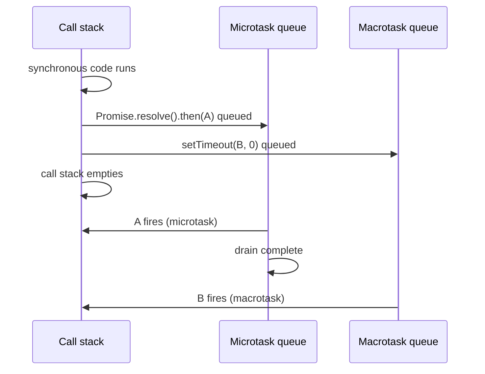

## Chain mechanics: each .then() is a new Promise

Every call to `.then()` allocates a new Promise object. The callback you register does not run immediately — it is dispatched to the microtask queue once the upstream Promise settles. When the callback returns, the new Promise settles with that return value. This sequence repeats for every link in the chain.

The implication: `.then()` callbacks never run synchronously, even if the upstream Promise is already fulfilled when `.then()` is called (as with `Promise.resolve()`).

## Microtask queue vs. macrotask queue

The JavaScript event loop processes queues in a fixed order:

1. Run the current synchronous task to completion.
2. Drain the **entire** microtask queue (Promise callbacks, queueMicrotask).
3. Pull one macrotask (setTimeout, setInterval, I/O) and run it.
4. Repeat.

`.then()` and `.catch()` callbacks are microtasks. `setTimeout` callbacks are macrotasks. No macrotask fires until every pending microtask has executed.



> **Example**
>
> ISAQuiz9 Q3 execution trace:
>
> ```js
> setTimeout(() => console.log('setTimeout1'), 0);
> Promise.resolve()
>   .then(() => console.log('then1'))
>   .then(() => console.log('then2'));
> setTimeout(() => console.log('setTimeout2'), 0);
> ```
>
> Execution order: `then1`, `then2`, `setTimeout1`, `setTimeout2`
>
> Step-by-step:
> 1. `setTimeout1` callback is scheduled in the macrotask queue.
> 2. `Promise.resolve()` creates an already-fulfilled Promise.
> 3. `.then(() => console.log('then1'))` registers a microtask — queued immediately.
> 4. `setTimeout2` callback is scheduled in the macrotask queue.
> 5. Call stack empties. Microtask queue drains:
>    - `then1` logs. The `.then('then2')` microtask is now queued.
>    - `then2` logs. Microtask queue is empty.
> 6. First macrotask fires: `setTimeout1` logs.
> 7. Second macrotask fires: `setTimeout2` logs.
>
> The two setTimeout callbacks never interleave with the two `.then()` callbacks.

> **Pitfall**
> A common wrong answer assumes `setTimeout1` fires between `then1` and `then2` because it was registered before the second `.then()`. The macrotask queue does not get a turn between microtasks — the entire microtask queue must be empty first.

## Error propagation through a chain

A throw inside any `.then()` callback rejects the Promise that `.then()` returned. The rejection skips every subsequent `.then()` until it reaches a `.catch()` (or a `.then()` with a second argument). After `.catch()` handles the error, the chain resumes as fulfilled (unless `.catch()` itself throws).

```js
Promise.resolve('start')
  .then(val => {
    throw new Error('mid-chain failure');
  })
  .then(val => {
    // skipped — upstream Promise is rejected
    console.log('never runs');
  })
  .catch(err => {
    console.log('caught:', err.message); // caught: mid-chain failure
    return 'recovered';
  })
  .then(val => {
    console.log(val); // recovered
  });
```

Returning a value from `.catch()` fulfills the next Promise with that value, resuming normal chain flow.

> **Pitfall**
> Placing `.catch()` before the end of the chain does not protect subsequent `.then()` calls from errors that originate after the `.catch()`. Each `.catch()` only handles rejections from upstream steps.

## .finally() — no value, full passthrough

`.finally(f)` is equivalent to `.then(f, f)` with one difference: `f` receives no argument (it is called with `undefined`). The Promise returned by `.finally()` adopts the original settled value (or rejection) from upstream, not the return value of `f`, unless `f` throws.

```js
Promise.resolve(42)
  .finally(() => {
    console.log('cleanup'); // cleanup
    // return value here is ignored
  })
  .then(val => {
    console.log(val); // 42 — original value passes through
  });
```

If the upstream Promise is rejected and `.finally()` does not throw, the rejection propagates past `.finally()` to the next `.catch()`.

> **Pitfall**
> ISAQuiz9 Q10 pattern — `.finally(() => { ... })` logs `undefined` if you try to print the callback argument. There is no argument — do not expect to receive the fulfilled value inside `.finally()`.

## Promise.resolve() and Promise.reject() as chain entry points

`Promise.resolve(value)` creates an already-fulfilled Promise. Because `.then()` callbacks are still dispatched as microtasks even on an already-settled Promise, `Promise.resolve(2).then(n => n * 3)` does not run synchronously.

`Promise.reject(reason)` creates an already-rejected Promise. The nearest `.catch()` downstream handles it.

These constructors are useful for wrapping synchronous values into a chain without writing a full executor, and for testing error-handling paths without needing an actual async operation.

## .catch() is .then(undefined, fn)

Slide 46 states this equivalence explicitly. The two forms are interchangeable. `.catch(fn)` is syntactic sugar. One behavioral difference: `.then(onFulfilled, onRejected)` cannot catch an error thrown by its own `onFulfilled` callback — you need a downstream `.catch()` for that.

> **Takeaway:** Every `.then()` returns a new Promise. Microtasks (`.then()`, `.catch()`) drain completely before any macrotask (`setTimeout`) fires. A throw inside `.then()` skips downstream `.then()` calls until a `.catch()` catches it. `.finally()` receives no argument and passes the upstream value (or rejection) through unchanged.
