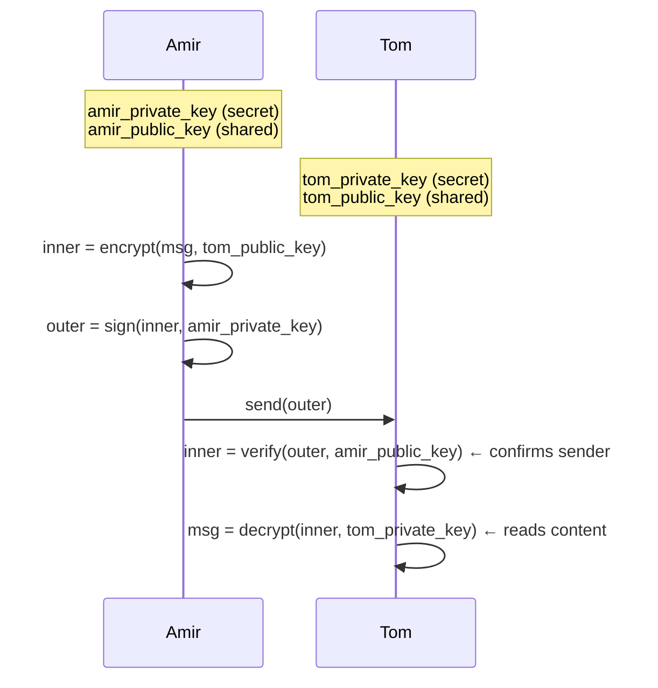

## Symmetric vs asymmetric encryption

| Property | Symmetric encryption | Asymmetric encryption |
|---|---|---|
| Number of keys | 1 (secret key, shared) | 2 (public key + private key, per party) |
| Key exchange required | Yes — both parties must obtain the same secret key before communicating | No — public keys are shared openly; private keys never leave their owner |
| Speed | Fast | Slower (computationally expensive) |
| Key compromise risk | Compromise of the single key breaks all past and future messages | Compromise of the private key affects only that party; public key can be reissued |
| Typical use cases | Bulk data encryption, TLS session data, disk encryption | Key exchange, digital signatures, OAuth, JWT signing, TLS handshake |

The core trade-off: symmetric encryption is efficient but requires a pre-shared secret key. Getting that key to the other party over an untrusted network is the key exchange problem. Asymmetric encryption sidesteps the problem entirely — public keys travel in the open because knowing a public key does not help an attacker decrypt messages or forge signatures.

---

## Key directions for asymmetric operations

These two operations are distinct. They use opposite key directions.

| Operation | Sender uses | Receiver uses |
|---|---|---|
| Signing (authenticity) | Sender's private key | Sender's public key (to verify) |
| Encryption (confidentiality) | Receiver's public key | Receiver's private key (to decrypt) |

Read this table carefully before any exam question on key directions. The receiver's keys are never involved in verifying a signature. The sender's keys are never involved in decrypting a message.

---

> **Example**
>
> The Amir→Tom double-envelope:
>
> Amir wants to send Tom a message that is both confidential and authenticated. Both parties have each other's public keys.
>
> 1. **Inner envelope (confidentiality):** Amir encrypts the message with **Tom's public key**. Only Tom's private key can open it.
> 2. **Outer envelope (authenticity):** Amir signs the inner envelope with **Amir's private key**. Anyone with Amir's public key can verify the signature.
> 3. **Tom verifies sender:** Tom opens the outer envelope using **Amir's public key**. Success proves the message came from Amir and was not tampered with.
> 4. **Tom decrypts content:** Tom opens the inner envelope using **Tom's private key**. Success proves only Tom can read the message.
>
> The key directions in steps 3 and 4 are opposite: step 3 uses the sender's public key (verification); step 4 uses the receiver's private key (decryption).

---

> **Pitfall**
> Signing is not encrypting — they use opposite key directions. ISAQuiz11 Q9 presents the Amir→Tom scenario and asks which key Tom uses to verify the message. The answer choices include all four key combinations (Tom's private key / Tom's public key / Amir's private key / Amir's public key). Only **Amir's public key** is correct. The distractor "Tom's private key" is the most seductive wrong answer — students reach for it because decryption uses the receiver's private key. But verification is not decryption. Verification uses the sender's public key. Getting these reversed is the single most common error on this topic.

---

## RSA and Diffie-Hellman

**RSA** is an asymmetric encryption algorithm that uses mathematically linked public/private key pairs to enable encryption and digital signing without a pre-shared secret.

**Diffie-Hellman** is a key-exchange protocol that lets two parties derive a shared secret key over an untrusted network without transmitting the key itself — solving the key exchange problem for symmetric encryption.

---

**Takeaway:** Asymmetric encryption uses two keys per party (public and private) and eliminates the key exchange problem. Signing uses the sender's private key; verification uses the sender's public key. Encryption uses the receiver's public key; decryption uses the receiver's private key. These directions are opposite and must not be swapped. RSA implements asymmetric cryptography; Diffie-Hellman establishes a shared secret key without transmitting it.
