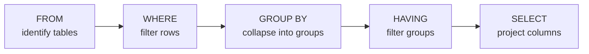

## SELECT * vs column list

`SELECT * FROM Customers` returns every column in every row. That is readable for exploration but expensive in production — the database transfers columns you never use.

List specific columns to narrow the result:

```sql
SELECT CustomerName, Country FROM Customers;
```

`SELECT all FROM Customers` is a syntax error. `all` is not a valid SQL keyword in that position. Use `*` for all columns.

---

## WHERE operators

WHERE accepts several comparison forms beyond `=`:

| Operator | Example |
|---|---|
| `=` | `WHERE Country = 'Mexico'` |
| `BETWEEN` | `WHERE CustomerID BETWEEN 1 AND 5` |
| `IN` | `WHERE Country IN ('Mexico', 'Canada')` |
| `LIKE` | `WHERE Country LIKE 'A%'` |

> **Pitfall**
> `WHERE department is 'HR'` looks plausible but is wrong. `IS` tests for NULL (`WHERE column IS NULL`). For string equality, always use `=`: `WHERE department = 'HR'`.

LIKE wildcards: `%` matches any sequence of characters; `_` matches exactly one character. The query `WHERE name LIKE 'a%' OR name LIKE 'B%'` returns every customer whose name starts with lowercase 'a' or uppercase 'B' — the two patterns are evaluated independently.

---

## Implicit JOIN (equi-join)

The comma syntax in FROM creates a Cartesian product first, then WHERE filters it:

```sql
-- Cartesian product: every patient paired with every visit
SELECT * FROM patient, visit;

-- Equi-join: only rows where patientid matches
SELECT * FROM patient, visit
WHERE patient.patientid = visit.patientid;
```

With 3 patients and 3 visits the bare comma returns 9 rows. The WHERE condition returns 3 matched rows.

Multi-table equi-join with an additional filter:

```sql
SELECT *
FROM Products, OrderDetails
WHERE Products.ProductID = OrderDetails.ProductID
  AND Quantity > 10;
```

---

## GROUP BY + HAVING order

Aggregates (COUNT, AVG, MAX, SUM) operate on groups formed by GROUP BY. The database processes clauses in this order:



1. FROM — identify tables
2. WHERE — filter individual rows
3. GROUP BY — collapse rows into groups
4. HAVING — filter groups by aggregate result
5. SELECT — project columns

Because WHERE runs before step 3, it cannot see the result of COUNT or AVG. Use HAVING for that.

```sql
-- Wrong: WHERE fires before grouping; c doesn't exist yet
SELECT Country, COUNT(CustomerID) AS c
FROM Customers
WHERE c > 2
GROUP BY Country;

-- Right: HAVING fires after grouping
SELECT Country, COUNT(CustomerID) AS c
FROM Customers
GROUP BY Country
HAVING c > 2;
```

HAVING can reference the alias `c` because it runs after SELECT has named it. WHERE cannot.

> **Pitfall**
> Placing WHERE after GROUP BY is a syntax error. The clause order is fixed: `WHERE` must precede `GROUP BY`; `HAVING` must follow it.

---

## Worked example: subquery construction

> **Example**
> Find every product priced above the catalogue average.

**Step 1** — write the inner query to compute the average:

```sql
SELECT AVG(price) FROM Products;
```

**Step 2** — use that result as a comparison value in the outer WHERE:

```sql
SELECT * FROM Products
WHERE price > (SELECT AVG(price) FROM Products);
```

The database runs the inner SELECT first, substitutes the scalar result, then evaluates the outer WHERE for each row.

**Step 3** — find the most expensive product(s):

```sql
SELECT * FROM Products
WHERE price = (SELECT MAX(price) FROM Products);
```

`=` works here only when exactly one product holds the maximum price. If ties exist, all tied rows are returned because `=` matches any row whose price equals the subquery's scalar result.

To find patients who have never visited, use `NOT IN` with a subquery:

```sql
SELECT * FROM patient
WHERE patientid NOT IN (SELECT patientid FROM visit);
```

`NOT IN` handles the set-membership check without requiring a JOIN. A LEFT JOIN with `WHERE visit.patientid IS NULL` achieves the same result.

---

## SQL injection and parameterized queries

Building SQL strings with template literals exposes your application to SQL injection. The `.replace()` string method is not a fix — a crafted input can still escape the replacement.

Use parameterized queries with `?` placeholders instead:

```js
// Vulnerable
db.query(`SELECT * FROM Users WHERE name = '${userInput}'`);

// Safe
db.query('SELECT * FROM Users WHERE name = ?', [userInput]);
```

The database driver treats the placeholder value as data, never as SQL syntax.

> **Takeaway**
> SQL clause evaluation order — FROM → WHERE → GROUP BY → HAVING → SELECT — explains three common failures: WHERE on an aggregate (HAVING runs later), alias in WHERE (alias is set in SELECT which runs last), and bare-comma FROM (Cartesian product until WHERE filters it). Parameterized queries with `?` placeholders are the only reliable SQL injection defense.
