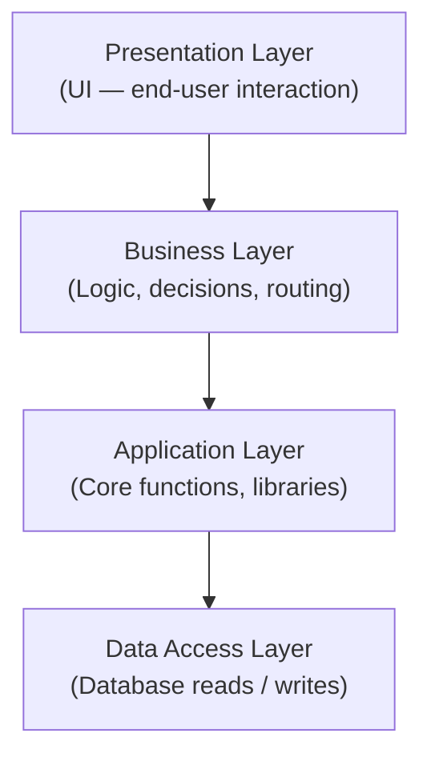

## Concrete anchor: why Messenger survives a Facebook outage

Messenger runs as an independent service. It has its own servers, its own deployment pipeline, and its own database. When Facebook's core app goes down, Messenger's service continues responding — because no single process bundles both. This is MSA (Microservice Architecture, equivalent to SOA in this course) in action: services are loosely coupled, independently deployable, and communicate only through APIs.

That concrete case generalizes: any system where one component failing would cascade to all others is monolithic. Any system where components can fail, be updated, or scaled independently is an MSA.

---

## All 8 patterns at a glance

| Pattern | Core purpose | Best for | Key trade-off |
|---------|-------------|----------|---------------|
| **Monolithic** | Single deployable unit; all logic bundled | Prototyping, MVPs, small teams | Every deploy requires full shutdown + recompile; hard to scale independently |
| **Layered (n-Tier)** | Separate concerns into horizontal slices | Enterprise apps needing testability and compliance | Strict layer discipline required; can become rigid |
| **MSA / SOA** | Loosely coupled, independently deployable services | Large orgs with multiple teams; high change velocity | Higher complexity; services communicate only via API |
| **Event-Driven** | Components react to events asynchronously (pub/sub) | Real-time pipelines, notification systems | Harder to trace causal chains; eventual consistency |
| **Serverless (FaaS)** | Stateless functions on cloud infra managed by provider | Unpredictable/spiky traffic, short-lived tasks | Cold-start latency; stateless limits complex workflows |
| **MVC** | Separate UI (View), logic (Controller), data (Model) | Web frameworks (Django, Rails, ASP.NET MVC) | Controller can bloat; tight coupling if boundaries blur |
| **MVVM** | Two-way data binding between View and data model | Rich client-side UIs (Angular, Vue, React + state) | More boilerplate; overkill for simple forms |
| **Micro-Frontends** | Break large front-end into independently deployable parts | Enterprise dashboards, multi-team front-ends | Integration complexity; shared-state coordination |

---

## Layered architecture — four layers

Each layer may only call the layer directly below it. The Presentation Layer never accesses the Data Access Layer directly — all data requests flow through the Business and Application layers first.

**Why banking uses this pattern:** auditors can certify that UI code never touches financial records. Each layer has a defined responsibility and can be tested in isolation.

---

## Example: Netflix fixes recommendations without touching billing

Netflix runs on MSA. Its recommendation engine is one service; billing is a separate service; video streaming is a third.

An engineer spots a bug in the recommendation ranking algorithm. The fix is:

1. Update and redeploy only the recommendation service.
2. The API gateway continues routing requests normally.
3. Billing, streaming, and search services receive no deployment; they are not restarted.
4. Users see updated recommendations within minutes of the push.

In a monolithic Netflix, step 1 would have required halting every user's active stream while the entire app recompiled and redeployed.

---

> **Pitfall**
> MSA and SOA are treated as equivalent in this course. The slide notes "MSA: Microservice Architecture / SOA: Service-Oriented Architecture — slightly different but refer the same thing in this course." Do not contrast them or treat SOA as a predecessor architecture.

> **Pitfall**
> Monolithic architecture is not inherently "bad." It is the appropriate choice for prototyping, MVPs, and apps that do not expect frequent independent feature updates. The costs (full-shutdown deploys, no independent scaling) only matter when complexity grows.

---

## CQRS and combining patterns

CQRS (Command Query Responsibility Segregation) separates write operations (commands) from read operations (queries) to optimize performance. LinkedIn uses CQRS for feeds and messaging.

Real systems combine patterns. Netflix uses MSA + event-driven + CQRS simultaneously. The combination is driven by scale and team structure, not by following a single architectural ideology.

---

**Takeaway:** Choose a pattern based on the type of change you need to make cheaply. MSA makes independent deployment cheap. Layered architecture makes compliance and testability cheap. Serverless makes unpredictable scaling cheap. No pattern is universally better — each moves cost from one dimension to another.
